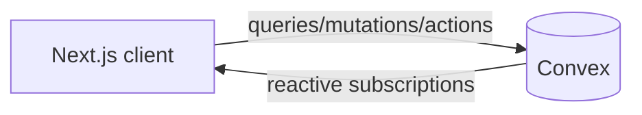

# System Architecture

Convex collapses backend, DB, realtime, and file storage into one vendor. Architecture is intentionally light.

## Architecture Diagram

## Component Responsibilities

| Component | Responsibility |
|---|---|
| Next.js (App Router) | UI, routing, SSR/RSC where useful, calls Convex via `useQuery`/`useMutation` |
| Convex queries | Read paths; reactive |
| Convex mutations | Write paths; transactional |
| Convex actions | External API calls, long-running work; called from mutations or scheduled |
| Convex scheduled functions | Cron / delayed work |
| Convex Auth | Session + identity |
| Convex storage | File uploads, signed URLs |

## External Services
<!-- Third-party APIs called from Convex actions. Remove if none. -->

| Service | Purpose | Called from |
|---|---|---|
| | | |

## Authentication Flow

Convex Auth. Identity available in every query/mutation/action via `ctx.auth.getUserIdentity()`. Authorization checks live inline in functions.

## Environments

| Environment | Convex deployment | Next.js URL |
|---|---|---|
| Development | dev deployment (`npx convex dev`) | localhost |
| Production | prod deployment | |
