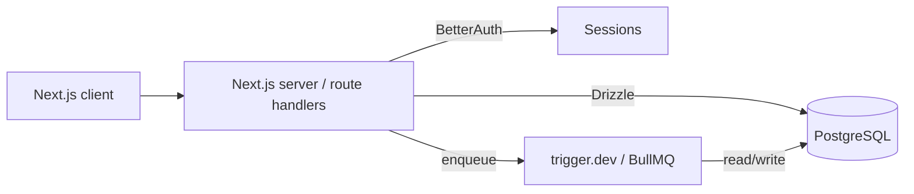

# System Architecture

## Architecture Diagram

## Component Responsibilities

| Component | Responsibility |
|---|---|
| Next.js client | UI, routing, SSR/RSC |
| Next.js server / route handlers | API surface, auth checks, business logic |
| Drizzle | DB access, schema, migrations |
| BetterAuth | Session + identity |
| Jobs runner | Background work (trigger.dev default) |
| Valkey | Cache / queue when BullMQ in use; rate-limit store |

## External Services
<!-- Third-party APIs. Remove if none. -->

| Service | Purpose | Notes |
|---|---|---|
| | | |

## Authentication Flow

BetterAuth issues sessions/JWTs. Server reads session in route handlers. For non-TS services, share secret or JWKS to validate JWTs (do not call BetterAuth directly from Go/Python).

## Environments

| Environment | Purpose | URL/Notes |
|---|---|---|
| Development | Local | |
| Staging | Pre-prod | |
| Production | Live | |
