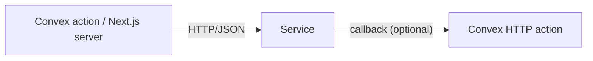

# System Architecture

## Service Shape

| Attribute | Value |
|---|---|
| Binary / image | |
| Concurrency model | (goroutines / async / process pool) |
| Persistent state? | Yes / No |
| External dependencies | (other APIs, models on disk, etc.) |

## Architecture Diagram

## Integration Pattern with Prime Stack

Pick one (§6):

| Pattern | When to use |
|---|---|
| Sync HTTP from Convex action | Work < 30s |
| Async job + callback (Convex enqueues, service processes, service POSTs to Convex HTTP action) | Work > 30s |
| Direct from client with Convex-issued token | When bandwidth matters (large file upload to service) |

Chosen pattern: __

## Endpoints (summary; full contract in 06)

| Endpoint | Method | Purpose |
|---|---|---|
| /healthz | GET | Liveness |
| | | |

## Authentication

Internal calls authenticated via shared secret OR a WorkOS-issued JWT validated against WorkOS's JWKS endpoint. Do not call the WorkOS Management API from this service on the hot path — pass the JWT from the caller and validate.

## Environments

| Environment | Deployment notes |
|---|---|
| Development | Local |
| Staging | |
| Production | |

## Observability

| Concern | Choice |
|---|---|
| Logging | slog (Go) / structlog (Python) — JSON to stdout |
| Metrics | (skip until justified per §14) |
| Tracing | (skip until justified per §14) |
